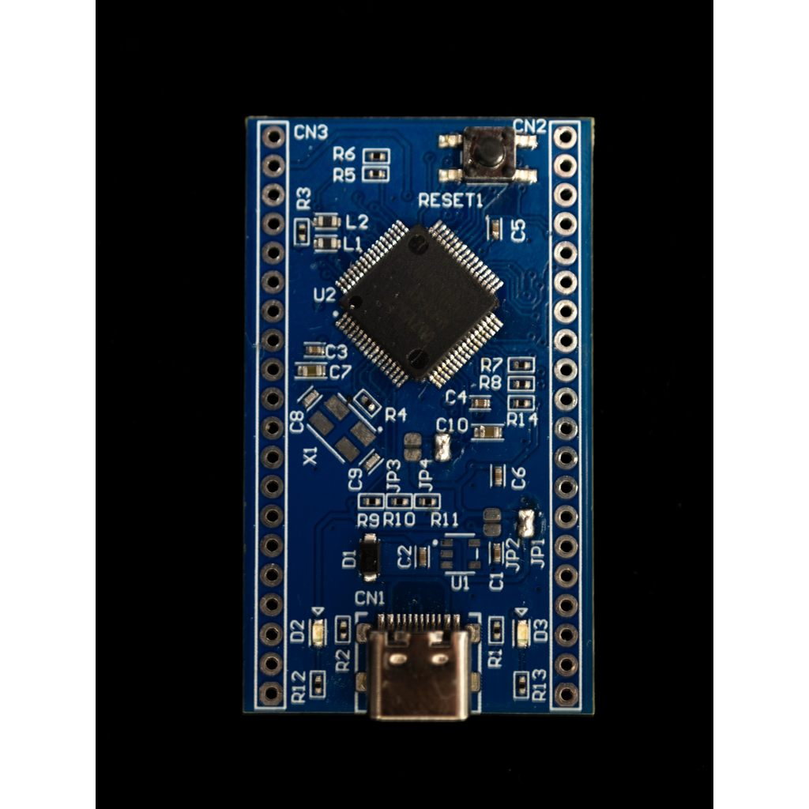
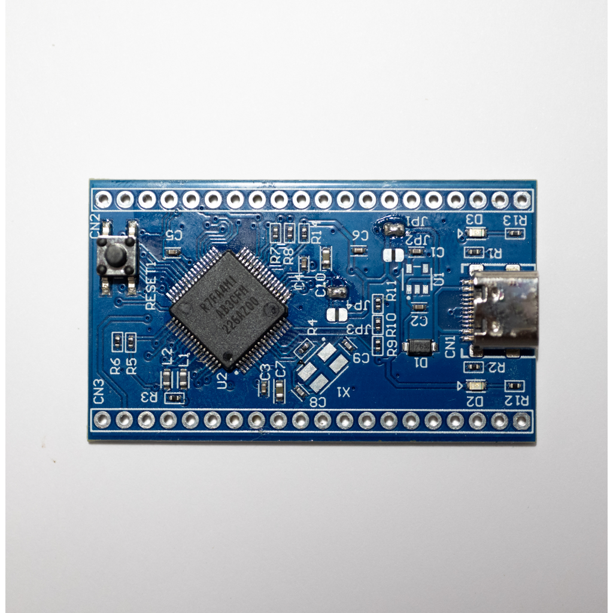
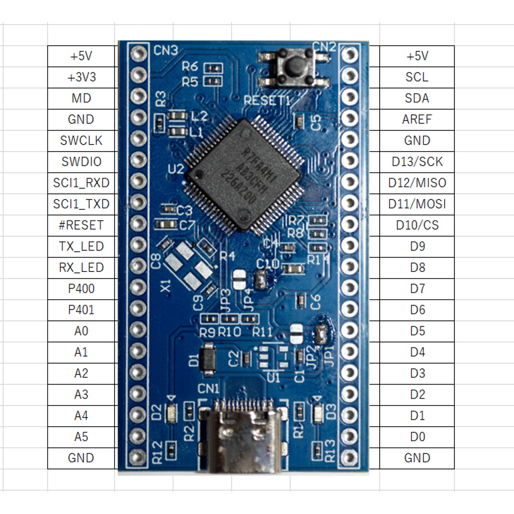

# AN-229 ElpisDuino R4

# 商品説明

Arfuino UNO R4 と同じRenesas RA4M1（Arm Cortex-M4）を用いたマイコンボードです。

Arduino R4互換機としても使用可能です。

既にArduino R4のBootloderが書き込まれており、Arduino R4として開発を行う事が出来ます。

# 仕様

- 基板サイズ   51.943mm x 52mm
- CPU
- USB : Type-C
- パッド：両面スルーホール（1mm穴 2mmパッド）
- 基板厚：1.6mm
- 追加機能：
   - Power用LED 有り
   - Lチカ用LED 有り
   - 5V動作、3.3V動作切り替えジャンパ　有り

# 内容物 

- 実装済み基板　１枚
- ピンヘッダ　１×２０（２個）

# 資料

- ピンアサイン

 - 回路図 & 外形寸法 & 部品表

   

# 販売サイト

# トピック
